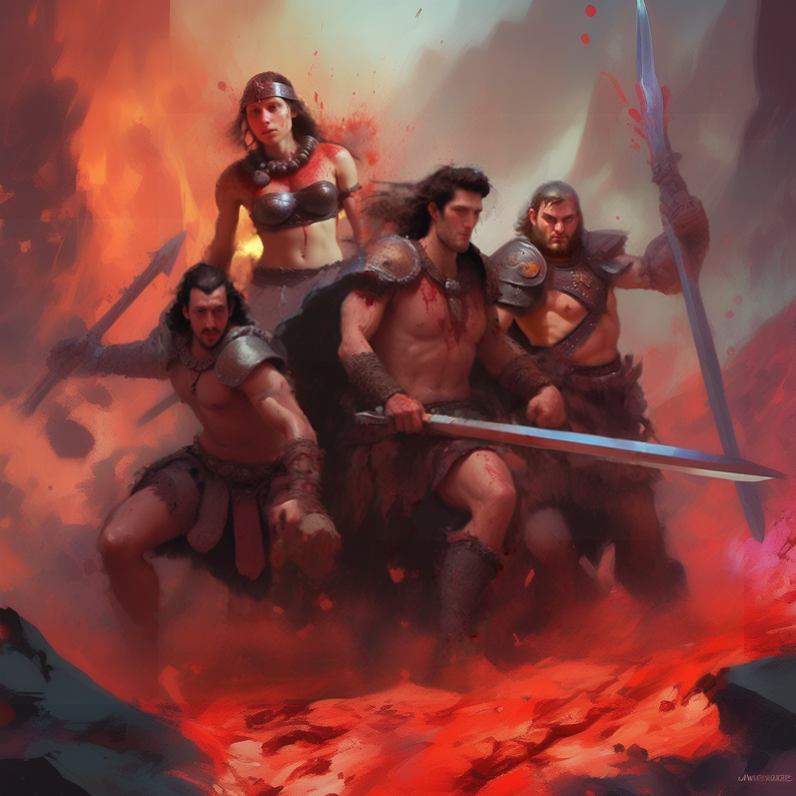

# SALT Multisubject

The ComfyUI node pack for multisubject generation is a set of tools designed to assist in generating images containing multiple individuals. It leverages the capabilities of Photomaker and implements the concept of Regional Aware Cross Attention from the [Mix-of-Show paper](https://showlab.github.io/Mix-of-Show/) for effective composition of multiple subjects in a single image.

### Installation

1. Install [ComfyUI](https://github.com/comfyanonymous/ComfyUI).
2. Install [ReActor Node for ComfyUI](https://github.com/Gourieff/comfyui-reactor-node).
3. Download the model from [Hugging Face](https://huggingface.co/TencentARC/PhotoMaker) and place it in a `photomaker` folder in your `models` folder such as `ComfyUI/models/photomaker`.
4. Clone this repo into `custom_nodes`

### Components
1. RegionalPromptingNode
The RegionalPromptingNode is responsible for detecting body and face regions of individuals based on pose information. It facilitates the initial segmentation of individuals within the input images.

2. RegionalAttentionProcessorNode
The RegionalAttentionProcessorNode extends the functionality of the SDXL model to incorporate Regional Aware Cross Attention. This node allows for dynamic adjustments in the number of individuals to be processed, enabling seamless handling of varying group sizes.

3. MultisubjectFaceSwapNode
The MultisubjectFaceSwapNode specializes in matching and swapping faces within a group photo. It utilizes the face-swapping capabilities from the ReActor node pack, allowing for the substitution of faces while preserving the overall composition of the image. Similar to the RegionalAttentionProcessorNode, it supports dynamic adjustments in the number of individuals to be processed.

| Original Image             | Image with Face Swap          |
|----------------------------|-------------------------------|
|  |  |

### Usage
Two distinct pipelines have been prepared to cater to scenarios involving different numbers of individuals:

For 2 Individuals
This pipeline utilizes LCM model to generate poses that align with the provided prompt. These poses are then utilized to generate an image containing the specified individuals. This approach is suitable for scenarios involving two individuals and ensures alignment with the given prompt.

For 3 or More Individuals
In scenarios involving three or more individuals, the LCM approach may not yield satisfactory results as it may generate fewer individuals than required while not fully adhering to the prompt. Therefore, this pipeline adopts a different strategy tailored to handle larger group compositions effectively.
